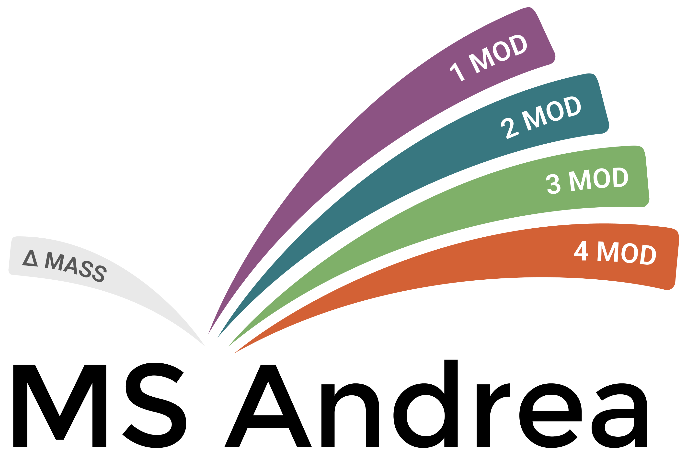

**MSAndrea** is an open modification search engine that is designed to directly identify peptide modifications on the PSM level. MS Andrea uses a sequence tag-based approach for filtering peptide candidates before score based filtering and final scoring using the [MS Amanda](https://github.com/hgb-bin-proteomics/MSAmanda) scoring function. 

## Installation and usage
### Installation on Windows
- Download MS Andrea for Windows here: [**download**](https://github.com/hgb-bin-proteomics/MSAndrea/tree/main/Releases/Latest/Windows/MSAndrea_release_Windows.zip)
- Extract the downloaded `.zip` file.
- Open a commandline and navigate to the extracted MS Andrea folder.
- Run MS Andrea by calling:
  ```bash
  MSAndrea.exe -s spectrumFile -d proteinDatabase -e settings.xml [-o outputfilename]
  ```

### Installation on Linux 
- Download MS Andrea for Linux here: [**download**](https://github.com/hgb-bin-proteomics/MSAndrea/blob/main/Releases/Latest/Linux/MSAndrea_release_Linux.zip)
- Extract the MS Andrea archive and navigate to the extracted folder in a terminal.
- MS Andrea for Linux can be used the same way as on Windows platforms.
- Run MS Andrea by calling:
  ```bash
  ./MSAndrea -s spectrumFile -d proteinDatabase -e settings.xml [-o outputfilename]
  ```

### Installation on macOS
- Download MS Andrea for macOS here: [**download**](https://github.com/hgb-bin-proteomics/MSAndrea/blob/main/Releases/Latest/macOS/MSAndrea_release_macOS.zip)
- Extract the MS Andrea archive and navigate to the extracted folder in a terminal.
- MS Andrea for macOS can be used the same way as on Windows platforms.
- Run MS Andrea by calling:
  ```bash
  ./MSAndrea -s spectrumFile -d proteinDatabase -e settings.xml [-o outputfilename]
  ```
## Getting Help
If something is not working or if you need help with MS Andrea, please contact us!

You can open an issue [here](https://github.com/hgb-bin-proteomics/MSAndrea/issues) or start a discussion [here](https://github.com/hgb-bin-proteomics/MSAndrea/discussions).

We are usually fast to respond on GitHub and other users might be able to help too!

Alternatively, you can contact us by e-mail (see below). 

## Contact 
- [proteomics@fh-hagenberg.at](mailto:proteomics@fh-hagenberg.at) \[preferred\] 
- [viktoria.dorfer@fh-hagenberg.at](mailto:viktoria.dorfer@fh-hagenberg.at)
- [louise.buur@fh-hagenberg.at](mailto:louise.buur@fh-hagenberg.at)